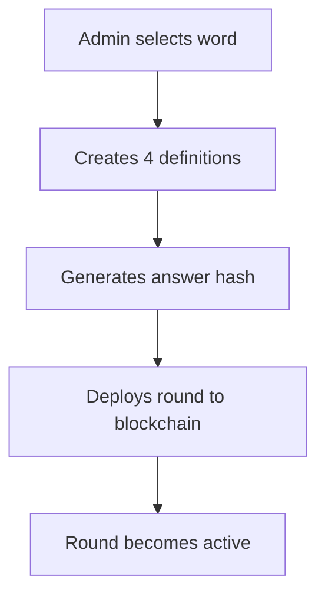
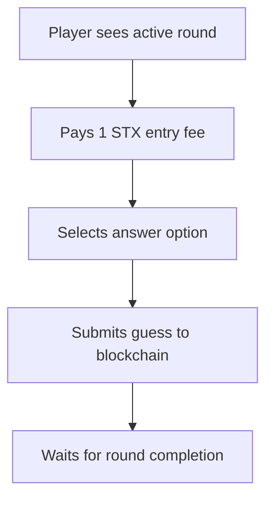
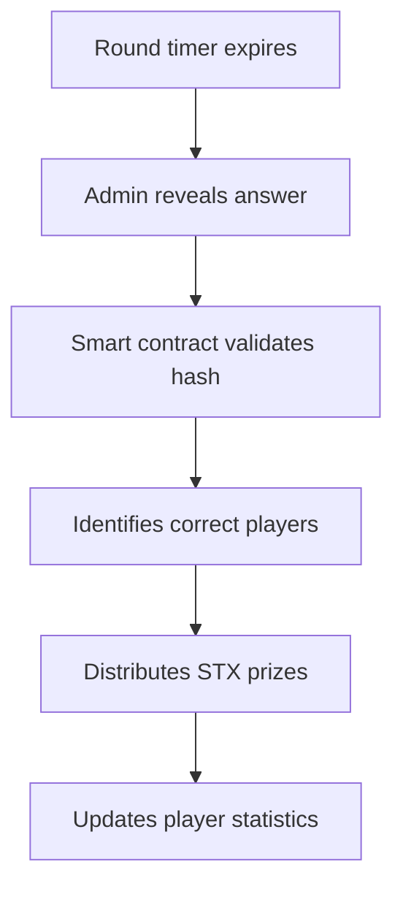

# 🧠 WordChain: Complete Project Overview

## 📋 Project Summary

**WordChain** is a revolutionary learn-to-earn vocabulary game built on the Stacks blockchain. Players learn new words while earning STX rewards through fair, transparent gameplay powered by smart contracts.

### 🎯 Core Concept
- **Educational Gaming**: Vocabulary challenges with multiple-choice questions
- **Blockchain Rewards**: STX prize pools distributed to correct answers
- **Fair Play**: Commit-reveal cryptographic scheme prevents manipulation
- **Community Driven**: Future DAO governance for content and features

## 🏗️ Technical Architecture

### Smart Contract Layer (`contracts/`)
```
wordchain-core.clar          # Main game logic
├── Round Management         # Create/manage vocabulary rounds  
├── Player Participation     # Join rounds, submit guesses
├── Prize Distribution       # Automatic STX rewards
├── Commit-Reveal Scheme     # Cryptographic fairness
└── Statistics Tracking      # Player performance data
```

**Key Features:**
- ✅ Secure round creation with answer hashing
- ✅ Fair prize pool distribution among winners
- ✅ Comprehensive input validation
- ✅ Treasury management with configurable fees
- ✅ Player statistics and leaderboard data

### Frontend Application (`frontend/`)
```
Next.js + React + TailwindCSS
├── Game Interface           # Play vocabulary rounds
├── Leaderboard             # Community rankings
├── Player Statistics       # Personal performance
├── Wallet Integration      # Hiro Wallet connection
└── Responsive Design       # Mobile-friendly UI
```

**Key Features:**
- ✅ Modern, intuitive user interface
- ✅ Real-time game state updates
- ✅ Comprehensive player statistics
- ✅ Mobile-responsive design
- ✅ Stacks blockchain integration

### Admin Tools (`admin-tools/`)
```
round-creator.js            # Interactive round creation
├── Word Input              # Vocabulary and definitions
├── Answer Hashing          # SHA256 commit-reveal
├── Contract Generation     # Ready-to-use Clarity calls
└── Educational Guidelines  # Content quality standards
```

## 🎮 Game Flow

### 1. Round Creation (Admin)


### 2. Player Participation


### 3. Round Completion


## 💰 Tokenomics

| Component | Value | Description |
|-----------|-------|-------------|
| **Entry Fee** | 1 STX | Cost to join each round |
| **Treasury Fee** | 5% | Platform sustainability |
| **Prize Pool** | 95% | Distributed to winners |
| **Round Duration** | ~24 hours | Time to submit guesses |

### Example Economics
**Round with 10 Players:**
- Total Entry Fees: 10 STX
- Treasury Fee: 0.5 STX (5%)
- Prize Pool: 9.5 STX (95%)
- If 3 players correct: 3.17 STX each

## 🔐 Security & Fairness

### Commit-Reveal Scheme
```
1. Admin creates hash: SHA256(word + correct_answer)
2. Hash stored on-chain before players guess
3. Players submit guesses during round
4. Admin reveals answer + validates against hash
5. Smart contract distributes prizes automatically
```

### Security Features
- ✅ **Cryptographic Fairness**: Impossible to manipulate answers
- ✅ **Access Control**: Only authorized admin can manage rounds
- ✅ **Input Validation**: Comprehensive parameter checking
- ✅ **Automatic Distribution**: No manual intervention for prizes
- ✅ **Transparent Operations**: All actions recorded on blockchain

## 📊 Current Status

### ✅ Completed Components

**Smart Contract (Production Ready)**
- Core game logic implemented
- Comprehensive test suite (12+ test cases)
- Security features and validations
- Gas-optimized operations

**Frontend Application (MVP Complete)**
- Full game interface
- Wallet integration
- Player statistics
- Responsive design

**Admin Tools (Functional)**
- Interactive round creator
- Answer hashing utility
- Contract call generation
- Educational guidelines

**Documentation (Comprehensive)**
- Technical specifications
- Deployment guides
- User instructions
- Security analysis

### 🚧 Future Enhancements

**Phase 2: Enhanced Features**
- [ ] DAO governance for word selection
- [ ] NFT achievement badges
- [ ] Advanced player statistics
- [ ] Mobile app development

**Phase 3: Ecosystem Expansion**
- [ ] Multiple game modes
- [ ] Educational partnerships
- [ ] Cross-chain integration
- [ ] AI-powered content generation

## 🚀 Deployment Readiness

### Testnet Deployment
- ✅ Smart contract tested and validated
- ✅ Frontend configured for testnet
- ✅ Admin tools ready for use
- ✅ Documentation complete

### Mainnet Considerations
- ✅ Security audit recommended
- ✅ Treasury management strategy
- ✅ Community governance plan
- ✅ Marketing and user acquisition

## 📈 Success Metrics

### Technical KPIs
- Contract deployment success rate
- Transaction throughput and costs
- Frontend performance metrics
- Security incident tracking

### Business KPIs
- Daily/Monthly active users
- Round participation rates
- Total STX volume processed
- Player retention and engagement

### Educational KPIs
- Vocabulary learning effectiveness
- Player skill progression
- Content quality ratings
- Community feedback scores

## 🤝 Community & Governance

### Current Structure
- **Admin-Managed**: Centralized round creation
- **Community Participation**: Open player access
- **Transparent Operations**: All actions on-chain

### Future DAO Integration
- **Governance Token**: Potential STX-based voting
- **Content Curation**: Community word selection
- **Treasury Management**: Decentralized fund allocation
- **Feature Development**: Community-driven roadmap

## 🎓 Educational Impact

### Learning Outcomes
- **Vocabulary Expansion**: Systematic word learning
- **Blockchain Literacy**: Hands-on DeFi experience
- **Financial Education**: Cryptocurrency rewards
- **Community Engagement**: Social learning environment

### Target Audiences
- **Students**: Gamified vocabulary building
- **Crypto Enthusiasts**: Learn-to-earn opportunities
- **Educators**: Blockchain-based teaching tools
- **General Public**: Accessible financial education

## 📞 Getting Started

### For Players
1. **Connect Wallet**: Use Hiro Wallet extension
2. **Join Round**: Pay 1 STX entry fee
3. **Submit Guess**: Choose correct definition
4. **Earn Rewards**: Share prize pool if correct

### For Administrators
1. **Deploy Contract**: Use provided deployment guide
2. **Create Rounds**: Use admin tools for content creation
3. **Monitor Activity**: Track participation and engagement
4. **Manage Treasury**: Handle platform sustainability

### For Developers
1. **Clone Repository**: Access complete codebase
2. **Run Tests**: Validate smart contract functionality
3. **Deploy Locally**: Test with Clarinet development environment
4. **Contribute**: Submit improvements and new features

## 🌟 Conclusion

WordChain represents a successful transformation from a simple Tic-Tac-Toe game to a comprehensive educational platform that combines:

- **Blockchain Technology**: Secure, transparent, decentralized
- **Educational Value**: Meaningful vocabulary learning
- **Economic Incentives**: Real STX rewards for learning
- **Community Building**: Shared learning experiences
- **Technical Excellence**: Production-ready smart contracts

The project is **ready for testnet deployment** and positioned for **mainnet launch** with proper security auditing and community building efforts.
